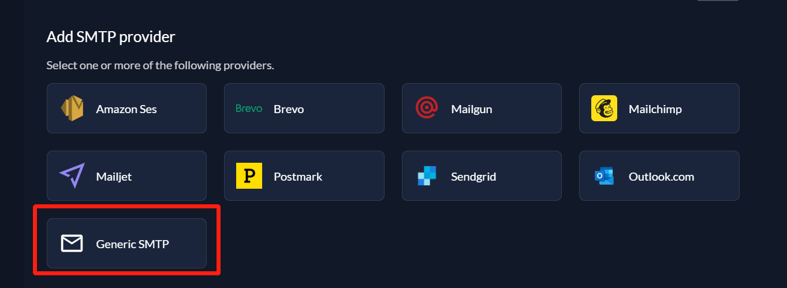
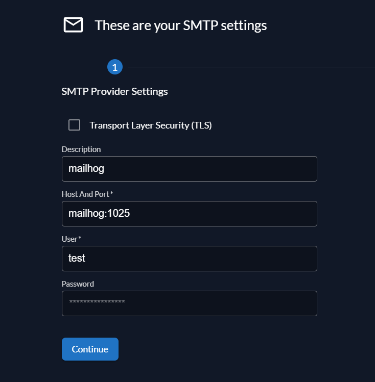

# 简介

[TOC]

基于ZITADEL的IAM技术demo

## 基本环境准备

- APISIX: API网关
- APISIX Dashboard:  APISIX控制面板
- ETCD: 用于APISIX持久化存储
- Caddy: 反向代理
- ZITADEL
- PostgreSQL: 用于ZITADEL持久化存储
- KeyCloak: 作为外部IDP使用
- Mailhog: 用于模拟邮件接收

执行以下命令启动它们:

```shell
cd deploy && docker compose up -d
```

修改你的hosts文件:

Windows

```shell
cd C:\Windows\System32\drivers\etc; Add-Content -Path .\hosts -Value "`n127.0.0.1    zitadel"; Add-Content -Path .\hosts -Value "`n127.0.0.1    generic-oidc"
```

Linux

```shell
echo -e "127.0.0.1    zitadel\n127.0.0.1    generic-oidc" | sudo tee -a /etc/hosts
```

在浏览器中访问 http://zitadel:8080/ ，打开ZITADEL控制台，使用以下凭证登录:

Login name: `zitadel-admin@zitadel.zitadel`
Passowrd: `Password1!`

访问 http://zitadel:8080/ui/console/instance?id=smtpprovider ，配置SMTP Server, 选择Generic SMTP:



填写配置项如下:

- Description: `mailhog`
- Host And Port: `mailhog:1025`
- User: `test`
- Password: `test`



完成后，点击 Continue 继续下一步配置:


- Sender Email Address: `zitadel@zitadel.com`
- Sender Name: `zitadel`
- Reply-to Address: `zitadel@zitadel.com`

完成后，点击 Save 保存配置

## 场景示例

场景示例中项目如下:

- apps/random-generator/backend : 这是一个随机值生成器，当前端调用它的HTTP接口时，返回随机数据
- apps/random-generator/frontend : 随机值生成器的前端页面，需要 ZITADEL 授权登录才可以访问
- apps/simple-auth: 这是一个权限校验服务，将用户权限信息存储在JSON文件中，提供一个支持多租户RBAC模型的权限校验接口

### 使用外部IDP授权登录

在这个示例中，我们的目标是通过KeyCloak中的用户来授权登录到ZITADEL

#### 配置KeyCloak

首先我们需要再KeyCloak中创建一个OIDC客户端，访问 http://generic-oidc:9998/ ，打开 KeyCloak 的控制台

- 用户名: admin
- 密码: admin

进入客户端页面，点击创建客户端 (http://generic-oidc:9998/admin/master/console/#/master/clients/add-client)

填写客户端配置

- Client ID: `generic-oidc`
- Name: `示例通用OIDC客户端`


到下一步的页面后，勾选 `Client authentication` 选项，开启客户端认证


继续到下一步的登录设置页面，配置回调地址验证和跨域

- Valid redirect URIs: `http://zitadel:8080/ui/login/login/externalidp/callback`
- Web origins: `http://zitadel:8080/`


完成创建之后，到 `generic-oidc` 客户端的配置页面，可以看到 `Credentials` 选项卡，我们需要在这里复制接下来所需的客户端秘钥


接下来，我们需要去 ZITADEL 中配置 IDP

#### 配置ZITADEL

访问 ZITADEL 的 IDP配置页面 http://zitadel:8080/ui/console/instance?id=idp

选择创建 Generic OIDC ，填入以下配置

- Name: `Generic OIDC Provider`
- Issuer: `http://generic-oidc:9998/realms/master`
- Client ID: `generic-oidc`
- Client Secret: `<your-secrert>`(使用先前从KeyCloak中获取的客户端秘钥)


#### 验证

完成上述配置之后, 你可以在 ZITADEL 控制台中，选择登录另一个账号


随后，你应该可以在登录页看到新的登录方式


选择 `Generic OIDC Provider` 进行登录, 你应该会跳转到 KeyCloak 的登录界面，使用管理员账号进行登录即可

因为此时 KeyCloak 的 admin 账户信息还不存在于 ZITADEL 中，你接下来需要选择在 ZITADEL 中绑定一个已存在的用户或是注册一个新用户


由于我们配置了邮件验证，因此接下来 ZITADEL 会向你发送一个验证邮件，我们可以访问 Maihog (http://localhost:8025/ ,
用户名密码为test/test) 查看刚刚收到的邮件


点击邮件中的验证链接, 完成注册

### 网关和权限控制集成

在这个示例中，APISIX 作为 `random-generator` 后端程序的API网关，负责令牌内省和权限校验

C4 Arch:


流程:


#### 在APISIX配置路由

执行以下脚本

```shell
curl -X PUT 'http://127.0.0.1:9180/apisix/admin/routes/1' \
    -H 'X-API-KEY: edd1c9f034335f136f87ad84b625c8f1' \
    -H 'Content-Type: application/json' \
    -d '{"uri":"/random/*","name":"random","methods":["GET","POST","PUT","DELETE","PATCH","HEAD","OPTIONS","CONNECT","TRACE","PURGE"],"plugins":{"forward-auth":{"_meta":{"disable":false},"request_headers":["Authorization","X-RESOURCE-TARGET","X-RESOURCE-METHOD"],"request_method":"POST","uri":"http://apisix:9080/check"},"proxy-rewrite":{"headers":{"X-RESOURCE-METHOD":"$request_method","X-RESOURCE-TARGET":"$uri"}}},"upstream":{"nodes":[{"host":"random-generator-api","port":5000,"weight":1}],"timeout":{"connect":6,"send":6,"read":6},"type":"roundrobin","scheme":"http","pass_host":"pass","keepalive_pool":{"idle_timeout":60,"requests":1000,"size":320}},"status":1}'
```

```shell
curl -X PUT 'http://127.0.0.1:9180/apisix/admin/routes/2' \
    -H 'X-API-KEY: edd1c9f034335f136f87ad84b625c8f1' \
    -H 'Content-Type: application/json' \
    -d '{"uri":"/check","name":"check","methods":["GET","POST","PUT","DELETE","PATCH","HEAD","OPTIONS","CONNECT","TRACE","PURGE"],"upstream":{"nodes":[{"host":"simple-auth","port":17010,"weight":1}],"timeout":{"connect":6,"send":6,"read":6},"type":"roundrobin","scheme":"http","pass_host":"pass","keepalive_pool":{"idle_timeout":60,"requests":1000,"size":320}},"status":1}'
```


#### 配置和启动权限校验服务

首先我们需要准备一些测试数据，回到 ZITADEL 的控制面板，分别在 [Organization 页面](http://zitadel:8080/ui/console/org)
和用户页面获取租户和用户ID:


在`apps/simple-auth/users.json` 中 ，修改对应的 `uid` 和 `tid`

```json lines
[
  {
    "uid": <replace-user-id-here>,
    "roles": [
      "admin"
    ],
    "tid": <replace-tenant-id-here>
  }
]

```

同理，在`apps/simple-auth/policy.csv`中, 第三列的值对应租户ID，我们需要将其替换

```csv
p, admin, <replace-tenant-id-here>, /random/*, GET
p, employee, <replace-tenant-id-here>, /random/integer, GET
```

在ZITADEL的[项目页面](http://zitadel:8080/ui/console/projects)，创建一个名为 `Demo` 的项目

在项目详情页中, 创建一个新的应用:

- Name: `API`
- Type: `API`
- Authentication Method: `Basic`


创建成功后, 你可以获得该应用的客户端凭证:


将 apps/simple-auth/docker-compose.yml 中的 `CLIENT_ID` 和 `CLIENT_SECRET` 环境变量替换为刚刚获取的凭证

随后执行以下命令启动权限校验服务

```shell
cd apps/simple-auth && docker compose up -d
````


#### 配置和启动示例APP

**random-generator**

首先我们需要回到在上一个环节创建的`Demo`项目的中，为示例APP创建一个新的应用

- Name: `random-generator`
- Type: `Web`
- Authentication Method: `PKCE`
- Redirect URI: `http://localhost:3000/`
- Post Logout URI: `http://localhost:3000/`


随后在该应用的详情页，配置Token中包含用户信息，因为在权限校验环节中我们需要用到用户信息


在 apps/random-generator/frontend/src/authConfig.js 中，将 `client_id` 修改为刚刚创建的应用的客户端ID

执行以下命令启动示例APP:

```shell
cd apps/random-generator && docker compose up -d
```

#### 验证

访问 http://localhost:3000/ ，登录后，点击 `Generate Random String` 或是 `Generate Random Integer` 对后端API发起请求，它们分别对应
`/random/string` 和 `random/integer/` 接口。

在我的示例中，我使用的用户是先前通过KeyCloak登录的 `admin` 用户，仅拥有 `employee` 角色, 因此只能访问 `random/integer/` 接口


如果我访问 `random/string` 接口，将会收到403的错误:


`
